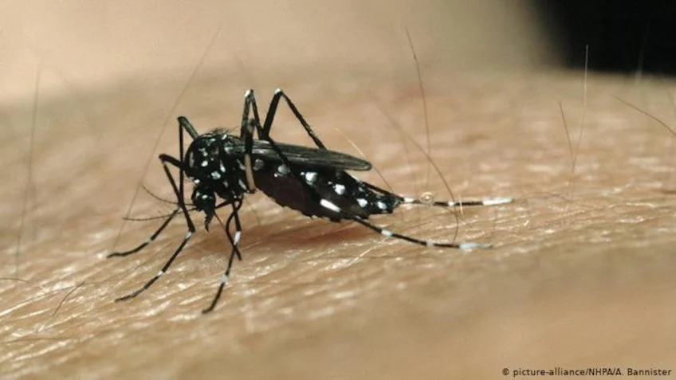

# Trabalho_Final_PCDAS: Análise espacial e socioeconômica dos casos de mortes por febres virais transmitidas por mosquitos no Estado do Rio de Janeiro

Trabalho final do grupo: 
 - Jenifer de Paula
 - Marcelo Rabaco
 - Raquel Martins   
 - Rosane Correa

  

   

As febres virais constituem um grupo de doenças de alta incidência e frequentemente relacionadas a agentes infecciosos em países tropicais. No contexto epidemiológico brasileiro, dentro desse grupo, destacam-se as arboviroses (DIAS, 2020). Neste projeto trabalharemos com febres virais, principalmente Dengue e Dengue hemorrágica, entre outras. Há 40 anos, o Brasil sofre com sucessivas epidemias de Dengue que causam milhares de episódios de adoecimento, óbitos, sobrecarga dos serviços de saúde e prejuízos sociais e econômicos inestimáveis (SBIm; SBI; SBMT, 2023). Deste modo entende-se, portanto, a importância de monitorar os dados sobre as febres virais para elaborar ações que viabilizem a prevenção e controle dessas doenças.

As febres virais, como Dengue, Zika e Chikungunya anualmente acometem milhares indivíduos em todo Brasil, acarretando internações e óbitos em todo o país. Em maio de 2023 o site do Ministério da Saúde publicou que até o final de abril, houve aumento de 30% no número de casos prováveis de dengue em comparação com o mesmo período de 2022 em todo Brasil. Já em relação à chikungunya, quando comparado ao mesmo período do ano passado, ocorreu um aumento de 40%. Em relação aos dados de Zika, até o final de abril, houve um aumento de 289% quando comparado ao mesmo período de 2022 (fonte: https://www.gov.br/saude/pt-br/assuntos/noticias-para-os-estados/sao-paulo/2023/maio/sao-paulo-registrou-201-mil-casos-provaveis-de-dengue-em-2023-entre-janeiro-e-abr/il). Segundo o site Info Dengue, da Fundação Oswaldo Cruz, no período de  6 de agosto de 2022 a 5 de agosto de 2023, só no estado do Rio de Janeiro, o total de casos de Dengue foi de 76809 e de Zika foi de 295 (fonte: https://info.dengue.mat.br/alerta/RJ/dengue).

Dessa forma, torna-se importante estudar o desenvolvimento das febres virais no Rio de Janeiro, entendendo como as doenças afetam cada região/município estado, tendo em vista as diferenças geográficas e sóciodemográficas entre os municípios, visando melhorar as decisões de Saúde Pública de forma direcionar melhor os recursos financeiros e verificar as regiões onde o foco do combate deve ser mais intensificado.

O objetivo do trabalho é fazer uma análise espacial dos casos de internação por febres virais que resultaram em óbitos no Estado do Rio de Janeiro no período entre 2010 a 2021, visando enterder melhor a distribuição os casos nos municípios tendo como base informações de posição geográfica dos municípios de ocorrência e sóciodemográficos populacionais.

Abra nosso Colab no link: https://github.com/RaquelSMartins/Trabalho_Final_PCDAS/blob/main/Trabalho_Final.ipynb 
